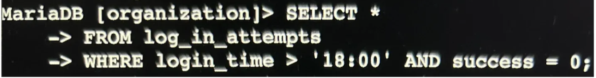

# Apply Filters to SQL Queries

## Project Description
As a security analyst, I needed to investigate potential security risks related to login attempts and employee devices. I used SQL to search through the organization's database and extract relevant information from the `log_in_attempts` and `employees` tables. This project demonstrates my ability to use various SQL filters and operators to retrieve specific data for security investigations and system updates.

## What I Learned
- How to use SQL comparison operators (>, <, =, >=, <=, <>, !=) to filter data based on specific conditions
- The difference between AND and OR logical operators and when to use each one
- How to use the NOT operator to exclude specific data from query results
- How to use pattern matching with the LIKE operator and wildcards (%) for flexible searching
- How to work with multiple tables (log_in_attempts and employees) to retrieve different types of data
- How to combine multiple conditions to create precise queries for security investigations
- The importance of efficient querying - using NOT to exclude one value instead of listing many values with OR
- How to investigate security incidents by filtering for suspicious activity patterns (after-hours logins, specific dates, geographic locations)

## Tools Used
- **SQL (Structured Query Language)** - Used to query and filter data from organizational databases
- **MariaDB** - Database management system used to store and manage organizational data
- **Database Tables**:
  - `log_in_attempts` - Contains login attempt records with timestamps, success/failure status, and location data
  - `employees` - Contains employee information including department and office location

## Steps Taken

### Ref 1: Retrieve After Hours Failed Login Attempts


**SQL Query:**
```sql
SELECT *
FROM log_in_attempts
WHERE login_time > '18:00' AND success = 0;
```

**Explanation:**
- I SELECTED all columns (*) FROM the `log_in_attempts` table to see complete login attempt records.
- I used the WHERE clause with two conditions:
  - `login_time > '18:00'` - to filter for login attempts that occurred after 6:00 PM (after work hours)
  - `success = 0` - to filter for failed login attempts (SQL uses Boolean: 1 for success, 0 for failure)
- The **AND** operator connects both conditions, meaning both must be true for a record to appear in the results.

**My thought process**: After-hours failed login attempts could indicate unauthorized access attempts when legitimate employees aren't working. By identifying these patterns, I can help the security team investigate potential security breaches or compromised accounts. The combination of "after hours" AND "failed" is particularly suspicious, as it suggests someone who doesn't have the correct credentials is trying to access the system when they think no one is monitoring.

**Key SQL Concepts Used:**
- **Comparison Operators**: 
  - `>` (Greater Than) - used to find times after 18:00
  - `=` (Equal To) - used to check if success equals 0
- **Logical Operator**: `AND` - ensures both conditions must be met

---

### Ref 2: Retrieve Login Attempts on Specific Dates


**SQL Query:**
```sql
SELECT *
FROM log_in_attempts
WHERE login_date = '2022-05-08' OR login_date = '2022-05-09';
```

**Explanation:**
- I SELECTED all columns (*) FROM the `log_in_attempts` table.
- I used the WHERE clause with the **OR** operator to filter for login attempts on two specific dates:
  - `login_date = '2022-05-08'` - May 8th, 2022
  - `login_date = '2022-05-09'` - May 9th, 2022
- The **OR** operator means that records matching either condition (or both) will be returned.
- I had to repeat `login_date =` for both dates to explicitly tell SQL that both conditions should check the same column.

**My thought process**: The company likely identified suspicious activity on these specific dates and needed to investigate all login attempts that occurred during this timeframe. By using OR instead of AND, I could capture all login attempts from either day, giving us a complete picture of activity during the suspicious period. This broad view helps identify patterns, suspicious accounts, or coordinated attack attempts that may have occurred across multiple days.

**Key SQL Concepts Used:**
- **Logical Operator**: `OR` - returns records that match either condition
- **Date Filtering**: Using date format 'YYYY-MM-DD' for precise date matching
- **Multiple Conditions**: Checking the same column against different values

---

### Ref 3: Retrieve Login Attempts Outside of Mexico


**SQL Query:**
```sql
SELECT *
FROM log_in_attempts
WHERE NOT country LIKE 'MEX%';
```

**Explanation:**
- I SELECTED all columns (*) FROM the `log_in_attempts` table.
- I used the WHERE clause with the **NOT** operator to exclude Mexico from the results.
- The **LIKE** operator combined with the wildcard `%` allows pattern matching:
  - `'MEX%'` matches any country entry that starts with "MEX"
  - This captures both 'MEX' and 'MEXICO' entries in the database
- The wildcard `%` represents zero or more characters, so any string starting with "MEX" will match.
- The **NOT** operator reverses the condition, showing all countries EXCEPT those matching the pattern.

**My thought process**: The company discovered that questionable login attempts were occurring, but they determined these suspicious activities did not originate from Mexico. To efficiently investigate where these threats were coming from, I needed to exclude Mexico from my search results. Using NOT with LIKE and the wildcard was more efficient than listing every other country individually. The wildcard was necessary because the database stored Mexico inconsistently - sometimes as 'MEX' and other times as 'MEXICO'. This query ensures I catch all variations and exclude them properly.

**Key SQL Concepts Used:**
- **Logical Operator**: `NOT` - excludes records matching the condition
- **Pattern Matching**: `LIKE` operator - enables wildcard searches
- **Wildcard**: `%` - matches any sequence of characters
- **Combined Usage**: `NOT ... LIKE 'pattern%'` - excludes all matches to the pattern

---

### Ref 4: Retrieve Employees in Marketing (East Building)


**SQL Query:**
```sql
SELECT *
FROM employees
WHERE office LIKE 'East%' AND department = 'Marketing';
```

**Explanation:**
- I switched to the `employees` table to access department-specific data for security updates.
- I SELECTED all columns (*) to see complete employee information.
- I used the WHERE clause with two conditions connected by **AND**:
  - `office LIKE 'East%'` - finds all offices in the East building (like East-118, East-136, etc.)
  - `department = 'Marketing'` - filters for only Marketing department employees
- The wildcard `%` after 'East' matches any characters following "East", capturing all East building office numbers.
- The **AND** operator ensures both conditions must be true - employees must be in BOTH the East building AND the Marketing department.

**My thought process**: The company needed to perform security updates on specific machines, so I had to identify exactly which employees' computers needed the update. Rather than manually searching through different office numbers in the East building (East-118, East-136, etc.), I used the LIKE operator with the wildcard to efficiently capture all East building offices at once. Then, by adding the department filter with AND, I narrowed it down to only Marketing employees in those East offices. This precision ensures we update the right machines without wasting time on employees in other departments or buildings.

**Key SQL Concepts Used:**
- **Table Switching**: Changed FROM `log_in_attempts` to `employees` table
- **Pattern Matching**: `LIKE 'East%'` - captures all variations of East office numbers
- **Wildcard**: `%` - matches any characters after "East"
- **Logical Operator**: `AND` - requires both conditions to be true
- **Exact Matching**: `=` for department name

---

### Ref 5: Retrieve Employees in Finance or Sales


**SQL Query:**
```sql
SELECT *
FROM employees
WHERE department = 'Sales' OR department = 'Finance';
```

**Explanation:**
- I continued working with the `employees` table.
- I SELECTED all columns (*) to get complete employee information.
- I used the WHERE clause with the **OR** operator to filter for employees in either department:
  - `department = 'Sales'` - filters for Sales department employees
  - `department = 'Finance'` - filters for Finance department employees
- The **OR** operator means employees from either department (or both, if someone somehow belonged to both) will be included in the results.
- I had to repeat `department =` for both conditions to explicitly specify that both conditions should check the same column.

**My thought process**: The company needed to perform a different security update specifically for machines in the Sales and Finance departments. Unlike the previous query where I used AND to narrow results, here I used OR to broaden the search to include two separate departments. This is because employees in these departments need the same update, regardless of which specific department they're in. By using OR, I efficiently captured all relevant employees in a single query rather than running two separate queries and combining the results manually.

**Key SQL Concepts Used:**
- **Logical Operator**: `OR` - includes records matching either condition
- **Multiple Conditions**: Checking the same column against different values
- **Exact Matching**: Using `=` for precise department names

---

### Ref 6: Retrieve All Employees Not in IT


**SQL Query:**
```sql
SELECT *
FROM employees
WHERE NOT department = 'Information Technology';
```

**Explanation:**
- I continued working with the `employees` table.
- I SELECTED all columns (*) to retrieve complete employee information.
- I used the WHERE clause with the **NOT** operator to exclude the IT department:
  - `NOT department = 'Information Technology'` - returns all employees whose department is NOT Information Technology
- The **NOT** operator reverses the condition, giving us every department except IT.
- This approach is much more efficient than listing every other department individually (Sales, Marketing, Finance, HR, etc.).

**My thought process**: The company needed to perform one final security update, but the IT department had already received this update. Rather than writing a lengthy query with multiple OR conditions to list every other department (Sales OR Marketing OR Finance OR HR, etc.), I used the NOT operator to simply exclude IT. This is more efficient, easier to read, and less prone to errors - I don't risk forgetting to include a department. Additionally, if new departments are added to the company in the future, this query will automatically include them without needing modification, as long as they're not IT.

**Key SQL Concepts Used:**
- **Logical Operator**: `NOT` - excludes records matching the condition
- **Efficient Filtering**: Excluding one value instead of listing many
- **Negative Logic**: Finding what you DON'T want rather than what you DO want

---

## Summary
By using various SQL filters including NOT, AND, OR, comparison operators (>, =), the LIKE operator, and wildcards (%), I was able to efficiently retrieve relevant data from two different database tables. These queries helped identify potential security threats through analysis of login patterns and enabled targeted security updates to specific employee machines based on department and location. This work directly contributed to strengthening the organization's overall security posture by:
- Identifying suspicious after-hours login attempts
- Investigating login activity during specific suspicious timeframes
- Analyzing geographic patterns in login attempts
- Enabling precise, department-specific security updates without disrupting operations

## Key Takeaways
- SQL filters are powerful tools for security investigations, allowing analysts to quickly identify patterns and anomalies
- Choosing the right operator (AND vs OR, NOT, LIKE) is crucial for getting accurate results
- Wildcards enable flexible searching when data formats vary
- Efficient queries (like using NOT instead of multiple OR conditions) save time and reduce errors
- Combining multiple conditions allows for precise targeting of specific data subsets
